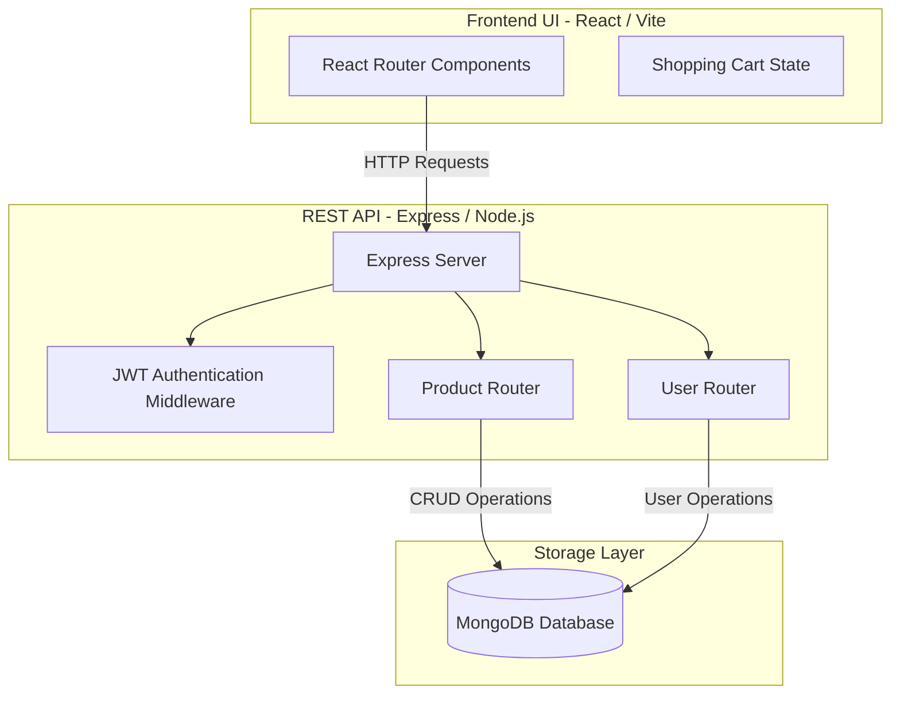

# Shades-Store

> A full-stack MERN e-commerce platform for curated eyewear.

[](https://react.dev/)
[](https://nodejs.org/)
[](https://www.mongodb.com/)
[](https://vitejs.dev/)
[](LICENSE)

Shades-Store is a full-stack, decoupled e-commerce application for browsing and purchasing eyewear. Built using the MERN stack (MongoDB, Express, React, Node.js), it includes features such as user authentication, product catalog filters, dynamic shopping carts, and administrative controls.

The backend is structured as an Express REST API utilizing Mongoose for document validation, while the frontend is a fast React client built using Vite, styled with Tailwind CSS, and optimized for seamless page routing.

---

## System Architecture

The application uses a standard decoupled client-server architecture:



---

## Features

*   **User Authentication**: JWT-based user signup, login, and protected route access.
*   **Product Catalog**: Dynamic product listings with price, category, and availability filters.
*   **Active Shopping Cart**: Client-side cart persistence using localStorage to maintain items across page reloads.
*   **Restful API Routing**: Clean routing design for user accounts and product updates.
*   **Responsive UI Layout**: Sleek, mobile-friendly design built with custom CSS classes.

---

## Tech Stack

| Layer | Technology | Description |
| :--- | :--- | :--- |
| **Frontend** | React 18, Vite, React Router, Tailwind CSS | Single-Page App (SPA) with fast Hot Module Replacement (HMR). |
| **Backend** | Node.js, Express.js | Event-driven REST API with JSON payload handling. |
| **Database** | MongoDB & Mongoose | Schemas for products and users with password hashing via `bcryptjs`. |
| **Auth** | JSON Web Tokens (JWT) | Stateless header validation for secure user routing. |
| **Deployment** | Vercel | Monorepo deployment configs included (`vercel.json`). |

---

## Local Setup

### Prerequisites
*   Node.js (v18 or higher) installed.
*   A running MongoDB database instance (local or MongoDB Atlas).

### 1. Backend Service Configuration
1. Navigate to the `backend/` folder:
   ```bash
   cd backend
   ```
2. Install server-side dependencies:
   ```bash
   npm install
   ```
3. Create a `.env` file in the `backend/` directory:
   ```env
   PORT=3001
   MONGO_URI=mongodb://localhost:27017/shades
   JWT_SECRET=your-jwt-secret-key
   ```
4. Seed or start the backend:
   ```bash
   node server.js
   ```

### 2. Frontend Client Configuration
1. Open a new terminal and navigate to the `frontend/` folder:
   ```bash
   cd frontend
   ```
2. Install client dependencies:
   ```bash
   npm install
   ```
3. Create a `.env` file in the `frontend/` directory:
   ```env
   VITE_API_URL=http://localhost:3001
   ```
4. Start the Vite React client:
   ```bash
   npm run dev
   ```
5. Navigate to the local URL (default: `http://localhost:5173`).

---

## API Endpoints

### User Routes (`/api/user`)
*   `POST /register` - Register a new account.
*   `POST /login` - Log in and obtain a JWT.
*   `GET /me` - Get profile metadata (requires JWT authorization header).

### Product Routes (`/api/products`)
*   `GET /` - Fetch all products.
*   `GET /:id` - Get details of a single product.
*   `POST /` - Add a new product (restricted use).
*   `DELETE /:id` - Delete a product index.

---

## Engineering Decisions

### 1. Monorepo Decoupling
The project is built as a monorepo containing distinct `frontend` and `backend` directories. This separation keeps the codebase modular, allowing the API service and user interface to compile independently and deploy to separate cloud platforms (e.g. Vercel and Heroku) without bundling conflicts.

### 2. Stateless Session Routing
JWTs are stored securely on the client-side to manage session authorization. This removes the need for memory-intensive session lookups in the Express backend, keeping endpoints stateless and ready to scale.

---

## Future Roadmap

1.  **Stripe Checkout Integration**: Add payment processing and checkout interfaces.
2.  **Product Reviews**: Add ratings and user comments sections.
3.  **Admin Dashboard**: Build a web-based portal to manage inventory and view purchases.

---

## License

MIT License — see [LICENSE](LICENSE) for details.
